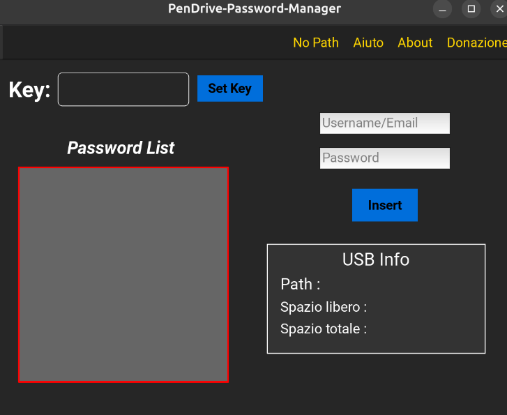

# PenDrive-Password-Manager
Tired of saving the password online? Tired of headache with password written in a piece of paper? Try this...

PenDrive Password Manager

  

Just a USB stick and a key, for all the password you want to store. No one will know it, just because is all crypted and because is hidden!
Also you can store a set of password with one key and other sets of password with other keys.

For find a password, just search with the key in the box entry and (if you write it correct), you can select for copy or BACKSPACE for delete.

Stay in relax, stay safe... but watch out the key! If you lost it, you can't recover it and I can't recover it (the same application also). You lose all the password inside associated with the key you lose. 
You can try to re-insert a password with an other key, or format the USB stick.

Language supported V0.1: English, Italian

Note: The language will change according to OS language

Programming language: Python

Crypting method: AES

  

  

Help me improve this app! Your feedback and suggestions are vital for its growth. If you find my work useful and would like to support its development, please consider making a donation. Every contribution helps me dedicate more time to building new features for you!

Thank you for reading, the developer,

Riccardo Sebastiani

Support email: infosoftware120@gmail.com

Ethereum address: 0xd76a7ae89b2479c5181A548Dd6315a67Dc37a597

XRP address:  rLNmmcNEizWaygypRVTKaWoZG6RrqfsJpi

Bitcoin address: bc1qv30jcnrfp68dqq2wdfaa74lrzvp0frwvku94ah

