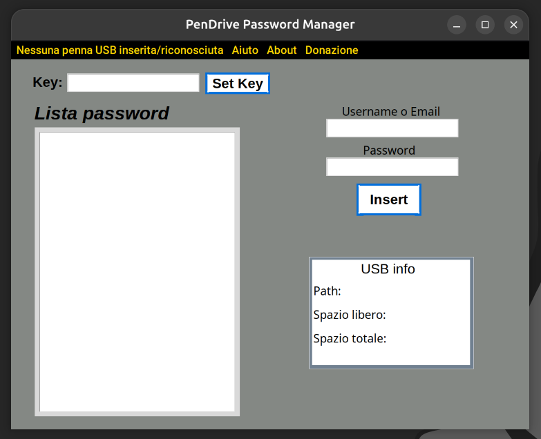

# PenDrive-Password-Manager
Tired of saving the password online? Tired of headache with password written in a piece of paper? Try this...

PenDrive Password Manager

  

Just a USB stick and a key, for all the password you want to store. No one will know it, just because is all crypted and because is hidden!
Also you can store a set of password with one key and other sets of password with other keys.

For find a password, just search with the key in the box entry and (if you write it correct), you can select and press CTRL+C for copy or BACKSPACE for delete.

Stay in relax, stay safe... but watch out the key! If you lost it, you can't recover it and I can't recover it (the same application also). You lose all the password inside associated with the key you lose. 
You can try to re-insert a password with an other key, or format the USB stick.

Language supported V0.1: English, Italian

Note: The language will change according to OS language

Programming language: Python

Consider to share changes per support this application.

Consider a donation if you want to support the developer
Thank you for reading, the developer 

Riccardo Sebastiani
